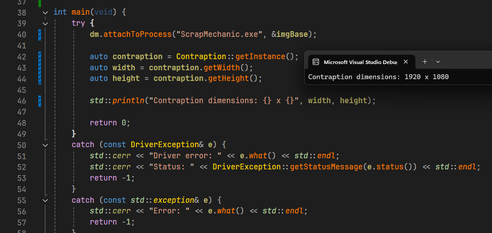

# Colonel

A km driver for memory access via an IOCTL interface.

Colonel is a demo kernel driver project that enables reading and writing memory in other processes  using IOCTL.



## Features

- Stealth: Imports and strings are hidden
- Usermode API: C++20 API with concepts and templates and RAII for easy interaction
- Memory access: Read and write memory in target processes using physmem
- Debug logging: Optional debug output for development and troubleshooting

## Architecture

### Kernel Driver

The kernel driver (`colonel/`) implements:

- An IOCTL interface: Three main control codes:
  - `INITCODE` (0x775): Attach to target process
  - `READCODE` (0x776): Read process memory
  - `WRITECODE` (0x777): Write process memory
- Symbolic Links: Creates `\\??\\colonelLink` and `\\DosDevices\\Global\\colonelLink` for usermode access

### Usermode code

The usermode component (`usermode/`) provides:

- DriverManager ClassRAII-style driver handle management
- Template-based read/write: concept constraints (for limiting to "addressable" types) allowing for ergonomic memory operations
- Process Management: Automatic PID resolution from process name

## Building

### Requirements

- Visual Studio 2022 or later
- Windows Driver Kit (WDK)
- Windows SDK
- C++20 compiler support

### Compilation

1. Open `colonel.sln` in Visual Studio
2. Select the desired configuration (Debug/Release) and platform (x64)
3. Build the solution

The build produces:
- `colonel.sys` - Kernel driver
- `usermode.exe` - Example usermode application

### Installation

Use [`kdmapper.exe`](https://github.com/TheCruZ/kdmapper) to load the `colonel.sys` driver
You can then interact with it via the usermode project

## IOCTL Codes

| Code      | Value |                     Description |
|-----------|-------|---------------------------------|
| INITCODE  | 0x775 | Attach to target process by PID |
| READCODE  | 0x776 | Read memory from target process |
| WRITECODE | 0x777 | Write memory to target process  |

## Debug Mode

Enable debug logging by defining `COLONEL_DEBUG` in `driver.h`:

```cpp
#define COLONEL_DEBUG
```

Debug messages are output via `DbgPrintEx` and can be viewed with tools like DebugView

## Documentation

The documentation can be found [here](https://colonel.rustbytes.uk) as a HTML site
It is generated using [Doxygen](https://www.doxygen.nl/index.html) from the source code comments which are also visible in many IDEs

## Dependencies

### Kernel Mode
- [kli.hpp](https://github.com/hypervisor/kli): Kernel lazy importer
- [skCrypter](https://github.com/skadro-official/skCrypter/): String encryption

## License

See the [LICENSE](LICENSE.md) file for details

## Contributing

Contributions are welcome! However, please ensure:
- Code follows the existing style
- All changes are documented
- Driver stability is maintained (you must check all buffers, sizes, and error codes and test your changes thoroughly)